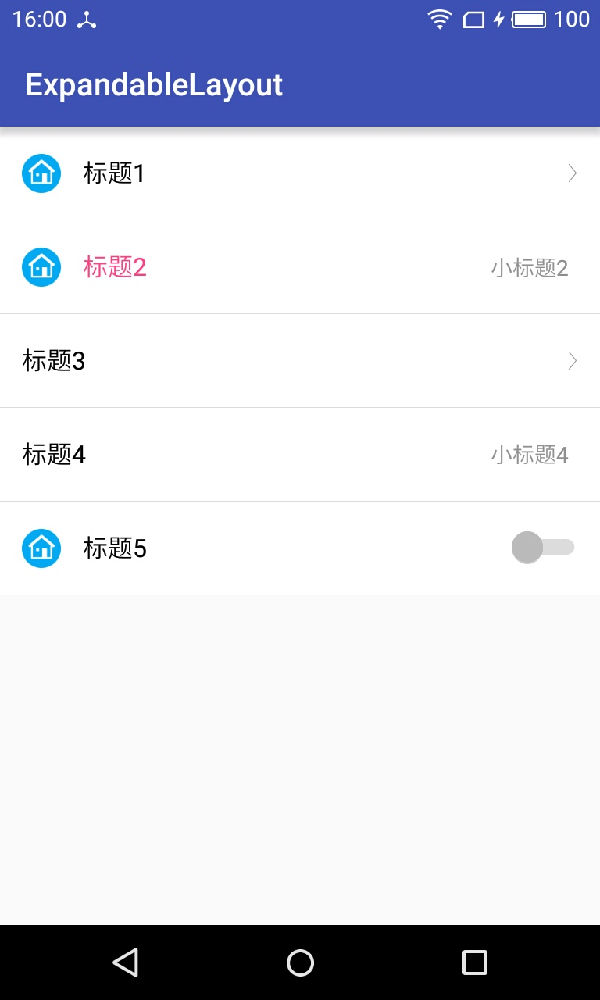

# ExpandableLayout
android ExpandableLayout能够让子View隐藏和展开，伸缩菜单




```
<attr name="titleHeight" format="dimension" />
        <attr name="titleBgColor" format="color" />
        <attr name="titleName" format="string" />
        <attr name="titleNameColor" format="color" />
        <attr name="titleNameSize" format="dimension|reference" />
        <attr name="titleIcon" format="reference" />

        <attr name="animDuration" format="integer" />
        <attr name="expandDrawable" format="reference" />
        <attr name="collapseDrawable" format="reference" />
        <attr name="isCollapse" format="boolean" />

        <attr name="mtextRight" format="string" localization="suggested" />
        <attr name="mtextRightColor" format="color" />
        <attr name="mtextRightSize" format="dimension" />
        <attr name="mdisplayArrow" format="boolean" />
        <attr name="mdisplaySwitch" format="boolean" />
        <attr name="mdividerVisibility" format="boolean" />
```

| 属性 | 释义 |
|--------|--------|
|    titleHeight    |    title高度    |
|    titleBgColor    |    title背景色    |
|    titleName    |    title标题    |
|    titleNameColor    |    title标题颜色    |
|    titleNameSize    |    title标题字体大小    |
|    titleIcon    |    title图标    |
|    animDuration    |    收缩动画时间    |
|    expandDrawable    |    title展开时右图标    |
|    collapseDrawable    |    title折叠时右图标    |
|    isCollapse    |    title是否折叠    |
|    mtextRight    |    title右标题    |
|    mtextRightColor    |    title右标题颜色    |
|    mtextRightSize    |    title右标题字体大小    |
|    mdisplayArrow    |    是否显示右图标    |
|    mdisplaySwitch    |    是否显示开关    |
|    mdividerVisibility    |    是否显示分割线    |

**监听展开与折叠**
```
expandableLayout.setOnExpandStateChangeListener(new ExpandableLayout.OnExpandStateChangeListener() {
            @Override
            public void onExpandStateChanged(boolean isExpanded) {
                if (isExpanded) {
                    Toast.makeText(MainActivity.this, "展开", Toast.LENGTH_SHORT).show();
                } else {
                    Toast.makeText(MainActivity.this, "折叠", Toast.LENGTH_SHORT).show();
                }
            }
        });

```
